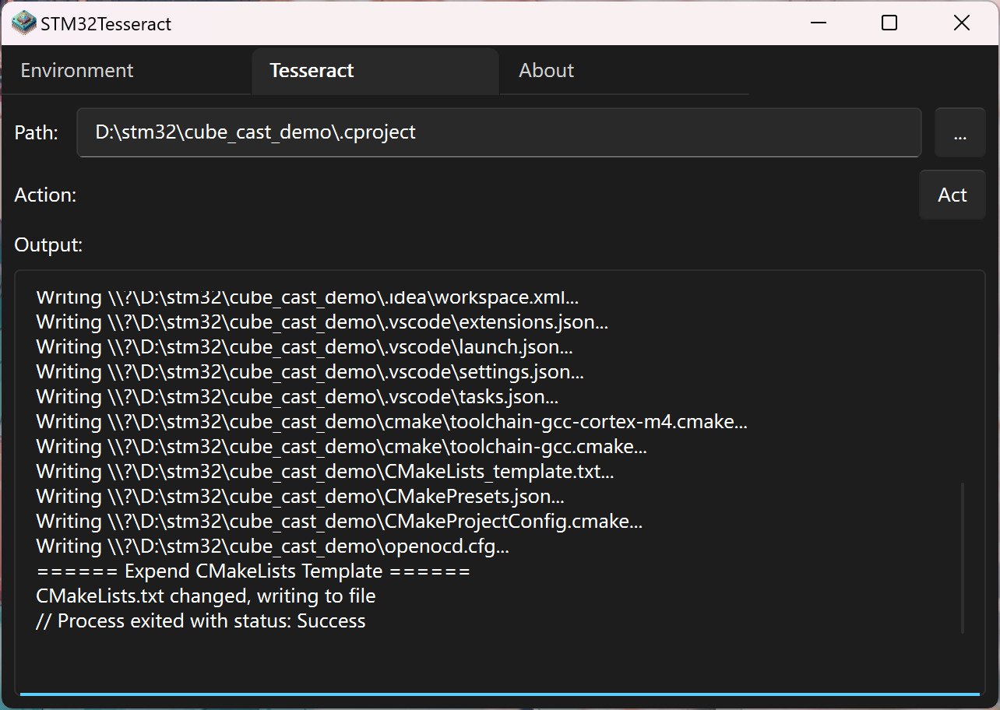

# Generate Project
STM32CubeMX is a powerful tool for initializing STM32 projects, but it often lacks support for modern, user-friendly toolchains. STM32Tesseract bridges this gap by reading the `.cproject` file generated by STM32CubeMX and creating a CMake project with configurations for Visual Studio Code and CLion.

:::note
When this utility developed, STM32CubeMX didn't support CMake as an output format. The STM32Tesseract utility was created to fill this gap. STM32CubeMX now supports CMake as an output format, but STM32Tesseract remains a valuable tool for users who prefer its features, since it provides out-of-the-box configurations for modern IDEs.

Additionally, the initial release of STM32CubeMX had buggy CMake support, though I'm not sure about its current state. STM32Tesseract focuses on CMake integration and create CMake projects based on `.cproject` files, ensuring a more reliable experience.
:::

## Steps
1. Create a project using STM32CubeMX.
2. Navigate to `Project Manager > Project > Project Settings > Toolchain / IDE > STM32CubeIDE`.  
   
3. Generate the code with STM32CubeMX.
4. Open `stm32tesseract-gui`.
5. Switch to the `Tesseract` tab.
6. Choose the `.cproject` file.
7. Click `Act` to initiate project generation.  
   
8. The CMake project, along with configurations for VSCode and CLion, will be created in the same directory as the `.cproject` file.