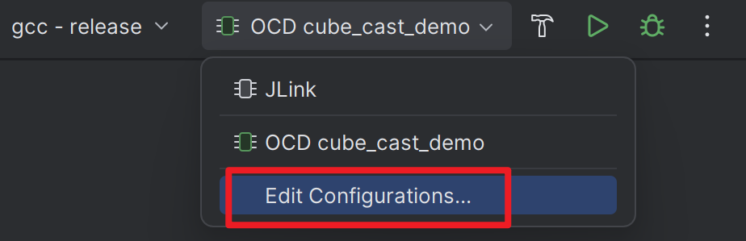

# CLion
CLion is a cross-platform IDE for C and C++ by JetBrains, which is tailored for embedded development. This guide will show you how to build, run, and debug generated CMake projects using CLion.

## Initial Setup
For first-time users of CLion:

1. Access `File > Settings` or use the shortcut `Ctrl + Alt + S`.
2. Go to `Build, Execution, Deployment > Embedded Development`.
3. Define the paths for the OpenOCD executable and STM32CubeMX executable.  
   
4. Click `Apply` and then `OK`.

## Building the Project
1. Open the project directory in CLion.
2. Click `Build` or press `Ctrl + F9`.

## Running the Project
### With OpenOCD
:::tip
OpenOCD is an open-source tool that provides on-chip programming and debugging support. For most types of adapters (eg. CMSIS-DAP or ST-Link), OpenOCD is a good choice to drive them. However, a significant exclusion is J-Link adapter, which is recommended to use JLink GDB Server for better performance and advanced features.
:::

1. Edit `openocd.cfg` to configure OpenOCD, see [Configure OpenOCD](/docs/config-openocd) to learn more. The default configuration is for CMSIS-DAP adapter.
2. Choose Run Configurations: `OCD {project-name}`.
3. Click `Run` or press `Shift + F10`.

## Debugging
### With OpenOCD
1. Edit `openocd.cfg` to configure OpenOCD, see [Configure OpenOCD](/docs/config-openocd) to learn more. The default configuration is for CMSIS-DAP adapter.
2. Select Run Configurations: `OCD {project-name}`.
3. Click `Debug` or press `Shift + F9`.

### With JLink
1. Select Run Configurations: `JLink`.
2. Specify the JLink GDB Server path by editing Run Configurations.  
   
   
3. Click `Debug` or press `Shift + F9`.

### Configure Peripheral View
Automatic configuration is not supported at the moment. You need manually download and load the SVD file for peripheral register viewing.
