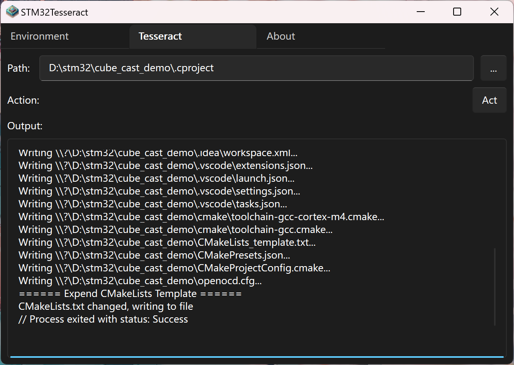

# 生成项目
STM32CubeMX 在初始化 STM32 项目方面十分强大，但是它缺乏对现代、用户友好型工具链的支持。为了弥补了这一不足，STM32Tesseract 可以读取 STM32CubeMX 生成的 `.cproject` 文件并创建一个已配置好的适用于 Visual Studio Code/CLion 的 CMake 项目。

:::note
开发该工具时，STM32CubeMX 尚未支持直接生成 CMake 格式的项目。STM32Tesseract 的诞生就是为了填补这一空白。STM32CubeMX 现在支持选择 CMake 作为输出格式，但 STM32Tesseract 对于喜欢其功能的用户来说仍然是一个十分好用的工具，因为它为现代 IDE 提供了开箱即用的配置。

此外，STM32CubeMX 的原生 CMake 支持在早期存在一些 bug，暂未知目前是否已经完全修复。STM32Tesseract 专注于 CMake 集成，并基于 `.cproject` 文件创建 CMake 项目，以确保更稳定的体验。
:::

## 步骤
1. 使用 STM32CubeMX 创建一个项目。
2. 依次点开 `Project Manager > Project > Project Settings > Toolchain / IDE > STM32CubeIDE`。  
   
3. 在 STM32CubeMX 中生成代码。
4. 打开 `stm32tesseract-gui`。
5. 切换到 `Tesseract` 栏。
6. 选择 `.cproject` 文件。
7. 点击 `Act` 开始生成项目。  
   
8. CMake 项目和 VSCode/CLion 的配置文件会被创建在 `.cproject` 文件的同目录下。