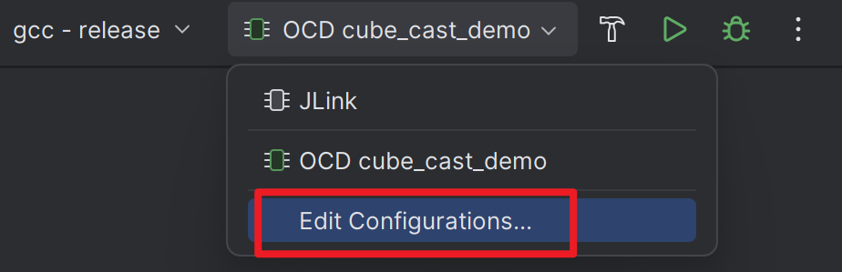
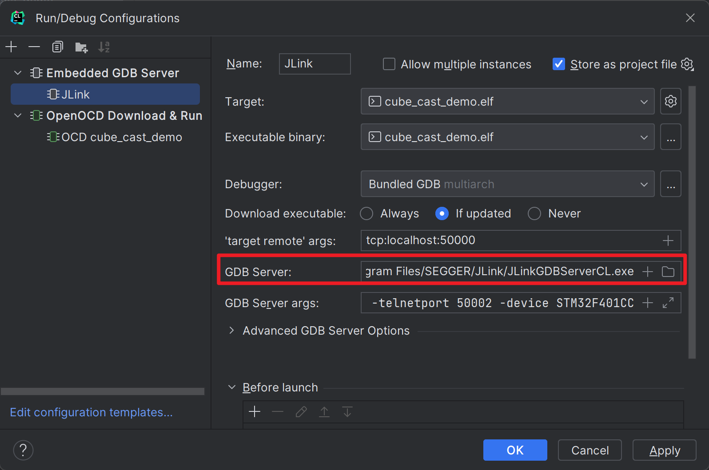

# CLion
CLion 是一款由 JetBrains 开发的用于编写 C/C++ 代码的跨平台 IDE，并提供对嵌入式开发的支持。本文将展示如何在 CLion 中构建、运行以及调试已生成的 CMake 项目。

## 准备步骤
如果您首次使用 CLion:

1. 打开 `File > Settings` 或使用快捷键 `Ctrl + Alt + S`。
2. 依次点开 `Build, Execution, Deployment > Embedded Development`。
3. 设置 OpenOCD 和 STM32CubeMX 可执行文件的路径。  
   
4. 点击 `Apply`，然后 `OK`。

## 构建项目
1. 在 CLion 中打开项目目录。
2. 点击 `Build` 或使用快捷键 `Ctrl + F9`。

## 运行项目
### 使用 OpenOCD
:::tip
OpenOCD 是一款提供了片上编程和调试支持的开源工具。对于绝大多数的烧录器（如 CMSIS-DAP 或 ST-Link），OpenOCD 是驱动它们的不错选择。不过，J-Link 适配器是一个例外，建议使用 JLink GDB Server 以获得更好的性能和更高级的功能。
:::

1. 编辑 `openocd.cfg` 来配置 OpenOCD，详情见[配置 OpenOCD](/docs/config-openocd)。默认的配置是使用 CMSIS-DAP 烧录器。
2. 选择运行配置 : `OCD {project-name}`。
3. 点击 `Run` 或使用快捷键 `Shift + F10`。

## 调试
### 使用 OpenOCD
1. 编辑 `openocd.cfg` 来配置 OpenOCD，详情见[配置 OpenOCD](/docs/config-openocd)。默认的配置是使用 CMSIS-DAP 烧录器。
2. 选择运行配置 : `OCD {project-name}`。
3. 点击 `Debug` 或使用快捷键 `Shift + F9`。

### 使用 JLink
1. 选择运行配置 : `JLink`。
2. 编辑运行配置，指定 JLink GDB Server 路径。  
   
   
3. 点击 `Debug` 或使用快捷键 `Shift + F9`。

### 配置外设视图
目前暂不支持自动配置外设信息。如果需要，请从设备制造商处下载 SVD 文件，并手动加载。
